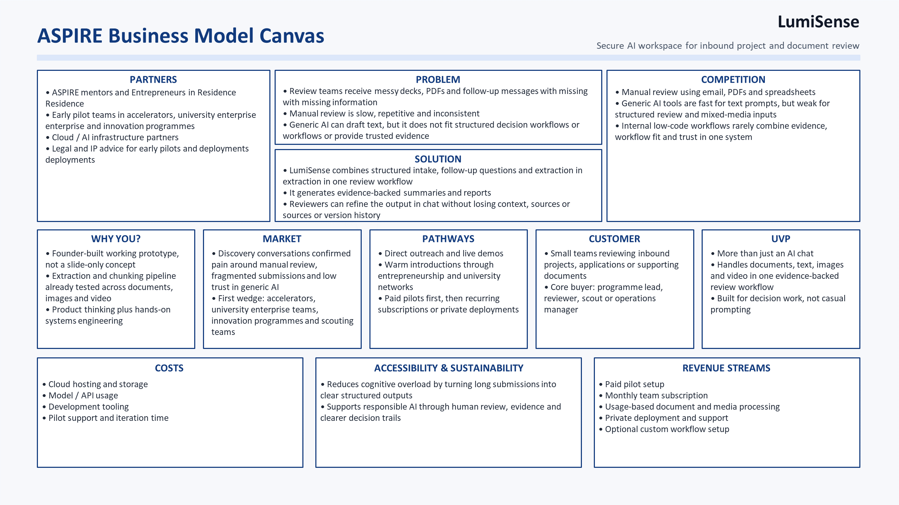
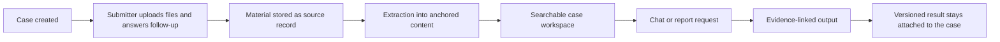
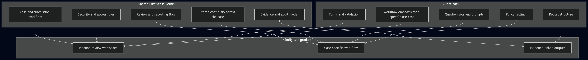

# LumiSense

LumiSense is a secure AI workspace for reviewing inbound projects, applications and supporting documents.

This repository is the public-facing package prepared for the University of Kent ASPIRE application. The engineering repository is private. Everything here is sanitized — no internal code, no customer material, no provider or infrastructure names.

## One-line pitch

LumiSense turns inbound submissions into evidence-backed summaries and reports that can be refined in chat without losing sources or version history.

## How it works

A case is opened. The submitter uploads files and answers follow-up questions. Content is extracted, anchored to the source and made searchable inside the case. The reviewer gets a summary or a structured report in which every claim links to underlying evidence. Follow-up questions and refinements stay attached to the same case, and outputs are versioned.

## Secure review flow

## Product shape

A shared kernel provides the workflow, evidence binding and security boundaries. Client-specific configuration adapts forms, questions, report structure and policies for a particular review use case.

## Demo

**Front-end walkthrough, earlier build.**

Shows an earlier prototype handling PDF, DOCX and TXT uploads through the intake and review flow. The current system covers more modalities — images, audio, video and other Office formats — but the front-end for those surfaces is not finalised yet.

**Benchmark run.**

A short benchmark run against the public-core pack. Three modalities in one run: a government PDF through the document lane, a Wikimedia image with Russian-language content processed through OCR and layout-aware chunking, and a NASA video clip split into time-anchored transcript segments. Each case produces typed chunks, anchors back to the source material, and review artefacts a reviewer can inspect.

Both recordings run on a dedicated development tenant with public material only — no client data, no production workload. Assets come from GovInfo, Wikimedia Commons and NASA, part of the pinned public-core pack described in [Benchmarks](./docs/benchmarks.md).

## First product wedge

Small teams reviewing inbound submissions: accelerators, university enterprise teams, innovation programmes, and scouting or evaluation teams.

## What's in this repository

- [Product core](./docs/product-core.md) — what the product does and who uses it
- [Architecture](./docs/architecture.md) — data layers, three-mode pipeline, kernel and client configuration
- [Security and trust](./docs/security-trust.md) — trust zones, tenant isolation, audit
- [Benchmarks](./docs/benchmarks.md) — pinned public assets, coverage, retrieval results
- [Roadmap](./docs/roadmap.md) — what works, what is in progress, what is open
- [Diagrams](./docs/media/) — sanitized workflow and architecture visuals
- [Submission package](./submission/) — canvas for the ASPIRE application
