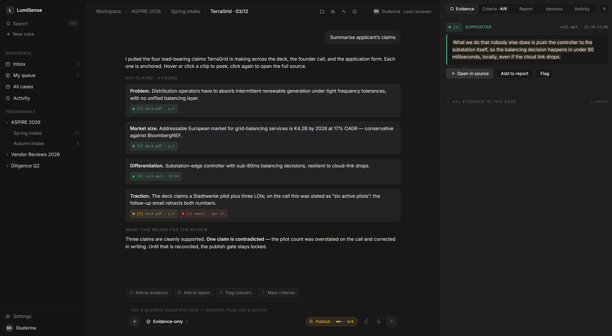
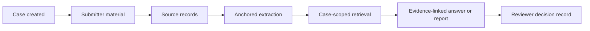
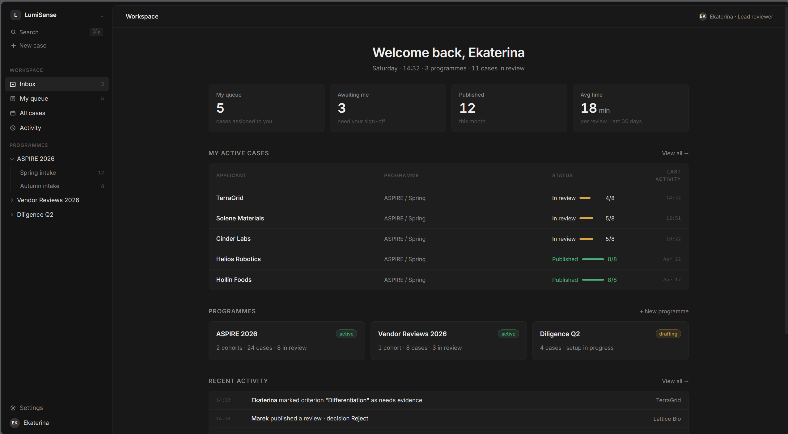
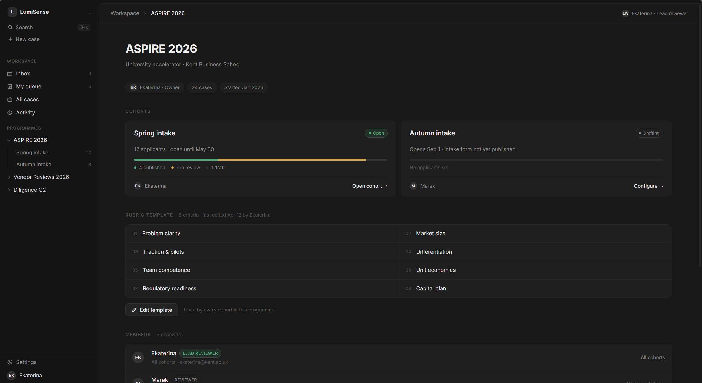
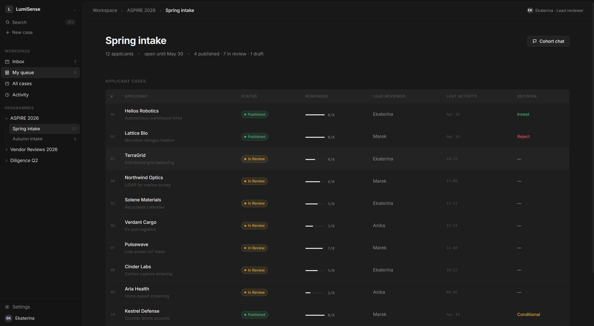
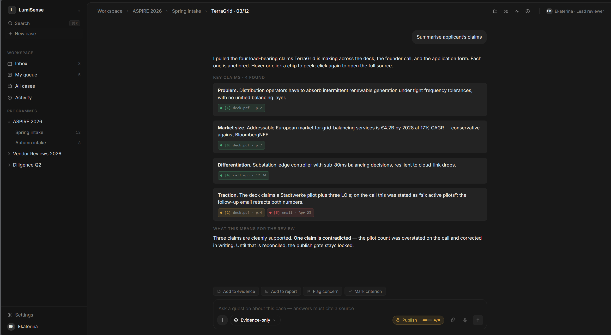
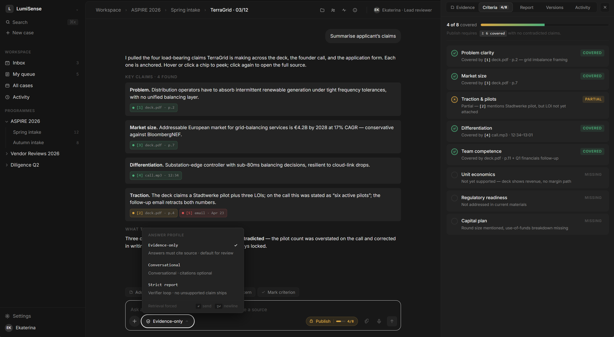
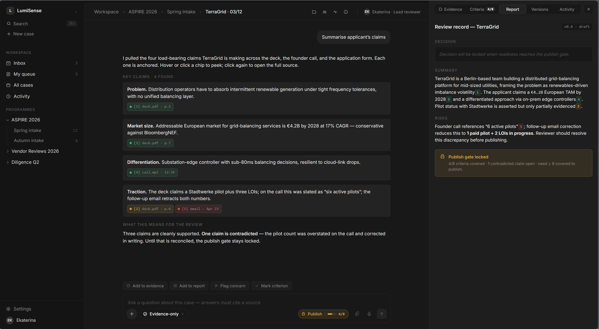

# LumiSense

Secure AI workspace for evidence-backed review of inbound submissions.

**Author:** Daniil Burmistrov, University of Kent (`meAloex` on GitHub).

LumiSense helps teams turn messy external material - applications, pitch decks, PDFs, forms, emails, interviews, images, audio and video - into structured review cases with source-backed summaries, criteria coverage, report drafts, version history and a human-owned decision trail.

This repository is the public ASPIRE package. The engineering repository is private. Everything here is sanitized: no internal code, no customer data, no provider secrets and no production infrastructure details.

## Demo Links

- [Front-end walkthrough, earlier build](https://youtu.be/bK4r3rzLW0U)
- [Benchmark run across document, image and video inputs](https://youtu.be/AmsceiSERGo)

## Quick Read

- **Product wedge:** inbound review for accelerators, university enterprise teams, grant programmes, scouting teams, due-diligence teams and vendor-risk workflows.
- **Core problem:** reviewers lose time across fragmented submissions, repeated follow-up, inconsistent scoring, unsupported claims and weak continuity between sessions.
- **Product answer:** a case workspace where AI helps extract, compare, summarise and draft, while every important claim remains tied to source evidence.
- **Memory layer:** context composition, case memory and graph-unit carry-forward preserve reviewer intent, source relationships, feedback and unresolved issues without turning old summaries into citable evidence.
- **Responsible AI stance:** evidence before persuasion, visible uncertainty, human reviewer ownership and auditability.
- **Current status:** implemented private prototype with a public sanitized package: docs, diagrams, videos, screenshots, benchmark notes and ASPIRE submission assets. Not a production SaaS launch.

## Why This Is Not Just ChatGPT or NotebookLM

ChatGPT and NotebookLM are strong horizontal tools for asking questions over context. LumiSense is intentionally narrower.

The unit of work is not a temporary chat or notebook. It is a review case with a programme, cohort, submitter, reviewer, evidence set, criteria, status, report state and history.

The goal is not only to produce a good answer. The goal is to help a human reviewer move from messy inbound material to a defensible decision record.

That difference matters when a reviewer needs to know:

- which claims are actually supported
- which criteria are still missing evidence
- where a contradiction came from
- what changed between report versions
- why a final decision was made

## Why This Matters for OpenAI

LumiSense is not a claim to build a better foundation model. It is product work around a harder adoption question: how do powerful AI systems become useful, safe and accountable inside real review workflows?

The project focuses on the layer around the model:

- secure intake for untrusted external material
- source anchoring and evidence references
- case-scoped retrieval instead of free-floating memory
- reviewer controls for adding, flagging and publishing evidence
- report verification before formal output
- audit records that make AI-assisted work inspectable later

This is the kind of product surface that lets strong models help without pretending the model is the decision-maker.

## Initial Buyer

The first buyer is a review owner with repeated external submissions: a university entrepreneurship programme lead, accelerator manager, grant programme manager, innovation team lead or diligence lead.

They already receive forms, decks, financial models, calls and follow-up material. Their pain is not only reading volume. It is that evidence, reviewer questions, criteria and decision history become scattered across tools.

The commercial shape is review capacity, not token resale: cases, indexed source material, transcript hours, published review records and bounded advanced review work for heavier scans, images, audio, video or second-pass checks.

## Product Workflow

A case starts with external material. The system extracts content, anchors it back to sources, builds a searchable case workspace and supports both chat-style follow-up and structured reports.

The intended reviewer experience is not "ask a bot and trust the answer". It is a workflow:

- see the queue and readiness of every case
- inspect the claims the system believes matter
- open the exact source behind an answer
- mark criteria as covered, partial or missing
- keep contradicted claims visible
- publish only when the review gate is satisfied

## Memory and Context Continuity

LumiSense treats memory as auditable case state, not as an invisible assistant profile.

The system separates four things that generic chat tools often blur together: conversation continuity, reviewer intent, retrieved evidence and citable source truth. A context manifest makes each answer inspectable: what history was kept, what was dropped, which evidence refs were available, and which refs are actually citable.

Graph-aware case memory connects claims, sources, criteria, reviewer feedback, report versions and unresolved risks. Feedback and observations attach to stable graph-unit keys, so useful memory can survive rebuilds when identity is preserved, while ambiguous carry-forward is quarantined rather than silently trusted.

## Screenshots

### Workspace Overview

Reviewers see active cases, programme queues, readiness and recent activity.

### Programme And Rubric

Each programme defines the criteria a submission is scored against, shared across every cohort in it.

### Cohort Queue

Cases are reviewed inside a cohort with readiness, reviewer ownership and decision status visible.

### Claims And Contradictions

The system pulls out the claims that carry a decision and anchors each one to its source. When a deck, a recorded call and a follow-up email disagree, the contradiction stays visible and the publish gate stays locked until it is resolved.

### Criteria Coverage

Readiness is tied to explicit criteria rather than a general feeling that the answer is complete.

### Report Gate

The report view shows summary, risks and whether a case is ready to publish. Contradicted claims and missing evidence should block formal output.

Additional screens are in [`assets/screenshots/`](./assets/screenshots/).

## Secure Evidence Base

LumiSense is designed around a secure evidence base, not a single prompt.

The intended base layer includes:

- controlled handling of untrusted submissions
- canonical source records for uploaded material and transcripts
- extracted content anchored back to the original source
- case-scoped retrieval so answers stay inside the relevant evidence set
- structured memory across claims, criteria, feedback and report versions
- server-side evidence references rather than free-form citation text
- tenant and case boundaries on every request
- report verification and versioned output history

This is why the product direction is not "AI chat for everything". It is a constrained review system for workflows where provenance, continuity and accountability matter.

## Demo and Validation

The public package does not expose internal queue topology or provider details, but it does show the validation discipline behind the product: pinned public assets, hand-authored oracle expectations, end-to-end ingestion checks, multimodal extraction checks, retrieval probes and citation/report verification.

That matters because the hard part is not only generating a summary. The hard part is proving that a summary can be traced back to the right source material, with anchors that still resolve, across documents, images, audio and video. See [Benchmarks](./docs/benchmarks.md) and the [benchmark validation diagram](./docs/media/04-benchmark-and-validation.md).

**Front-end walkthrough, earlier build**

Shows an earlier prototype handling PDF, DOCX and TXT uploads through the intake and review flow. The current product direction covers more modalities, but not every front-end surface is final.

**Benchmark run**

Shows a short run against the public-core pack: a government PDF through the document lane, a Wikimedia image with Russian-language content through OCR and layout-aware chunking, and a NASA video clip split into time-anchored transcript segments.

The benchmark story is intentionally modest. It is a development proof lane, not a claim of production maturity. Details are in [Benchmarks](./docs/benchmarks.md).

## What Exists Today

This public repository contains:

- product positioning and ASPIRE-facing story
- sanitized workflow and architecture docs
- screenshots of the intended reviewer workspace
- public-demo videos
- benchmark notes and coverage limits
- the ASPIRE business model canvas

The private engineering work behind the package has explored the secure review kernel: intake, extraction, source anchoring, retrieval, evidence-linked chat/report outputs, verification flows and audit records.

Current honest status:

- implemented private prototype, not a production SaaS launch
- public package, not the full source repository
- benchmark-backed development work, not broad customer validation
- no compliance certification claim
- no claim that AI replaces reviewer judgement

## ASPIRE Submission

The one-page business model canvas is included in [`submission/`](./submission/).

## Repository Guide

- [Product core](./docs/product-core.md) - what the product does and who uses it
- [Architecture](./docs/architecture.md) - data layers, pipeline modes, kernel and client configuration
- [Security and trust](./docs/security-trust.md) - trust zones, tenant isolation and audit posture
- [Benchmarks](./docs/benchmarks.md) - pinned public assets, oracle truth, E2E checks and retrieval notes
- [Roadmap](./docs/roadmap.md) - what works, what is in progress and what remains open
- [Media diagrams](./docs/media/) - sanitized workflow and architecture visuals
- [Submission package](./submission/) - ASPIRE canvas and outward-facing assets

## What LumiSense Is Not

- not a ChatGPT replacement
- not a NotebookLM clone
- not a generic RAG demo
- not a no-code automation builder
- not a document extraction API for developers
- not an "AI platform for everything"
- not a claim that AI should make final review decisions

## Public Link

https://github.com/meAloex/LumiSense-Aspire
