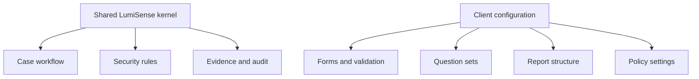

# Architecture

LumiSense is built as a case workflow, not as a single prompt window. The system has four data layers, one pipeline with three modes, and a separation between core behaviour and client-specific configuration.

## Four data layers

- Raw inputs, stored as the source record
- Canonical extracted content, anchored back to raw
- Searchable review data, derived from canonical content
- Audit and run history, immutable and per-tenant

Separating these layers is what makes repeat processing, evidence binding and audit possible without rewriting the workflow.

## Review flow

### Raw storage

Uploaded files are retained as original inputs. This gives the system a fixed source of record and makes repeat processing possible when extractors or policies change.

### Extraction and structuring

Content is converted into a usable internal form: text, tables, transcript segments, image captions, all tied to positional anchors back to the original file. Audio and video are processed through transcript extraction with temporal anchors, so a cited segment in a report can point to a specific moment in the source.

Extraction is not a single provider. Multiple lanes run in parallel, and a policy gate reviews coverage, anchor presence and warnings. If a lane produces weak output, augmentation or rescue lanes are routed automatically without losing the original submission.

### Searchable review layer

The searchable layer is built from canonical content, not from raw uploads. Retrieval combines vector, keyword and graph signals and returns passages that can be hydrated back to their source element.

### Chat and report workflow

The same case supports question answering, follow-up analysis and formal report generation. Conversation history, evidence references and versioned outputs all live in the case. Review work stays tied to the case instead of disappearing into isolated prompts.

## Three-mode pipeline

The pipeline runs three review modes, chosen per request:

| Mode | Retrieval | Verification | Citations | Typical use |
|------|-----------|--------------|-----------|-------------|
| Fast | Optional | No | No | Quick follow-up |
| Evidence | Required | No | Inline | Source-linked answers |
| Strict | Required | Required | Full evidence map | Formal reports |

The modes do not fork into three products — ingestion, retrieval, case state and audit are shared. A policy tier chooses how strict the output path is for a given request.

## Kernel and client configuration

The kernel provides the workflow, evidence binding and security boundaries. Client configuration adapts forms, questions, report structure and policies for a specific review use case. The core rules do not change.
