# Secure Review Flow

End-to-end review flow from case creation to a versioned output that stays attached to the case.

## Diagram

```mermaid
flowchart LR
    A["Case created"] --> B["Submitter receives access link"]
    B --> C["Form, files, links, and supporting material submitted"]
    C --> D["Missing details collected through the same case flow"]
    D --> E["Submitted material retained as source record"]
    E --> F["Content processed into a reviewable case workspace"]
    F --> G["Reviewer sees summary, evidence, and case history"]
    G --> H["Questions, follow-up, or report request"]
    H --> I["Evidence-linked output produced"]
    I --> J["Updated version stays attached to the same case"]
```

LumiSense turns inbound submissions into a structured review process rather than a one-off prompt.
