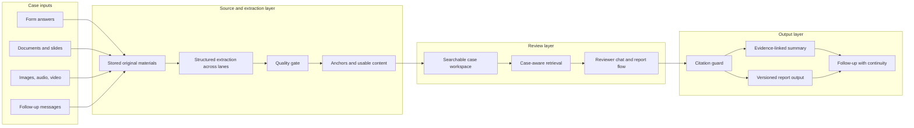

# Evidence Pipeline

Internal flow at a public-safe level: raw material is retained, canonical content becomes the working review surface, and outputs are verified against sources before publish.

## Diagram

## Quality gate

Extraction runs across multiple lanes. The quality gate reviews coverage, anchor presence and warnings, and routes weak output through augmentation or rescue lanes without discarding the original submission.

## Citation guard

Before an output is finalised, each cited passage is checked: the quote must exist in the source, the anchor must resolve, and the reference must belong to the current case. Claims without verified evidence do not enter a formal report.

LumiSense keeps review outputs tied to stored source material and verifies citations before publishing, rather than trusting prompt context alone.
