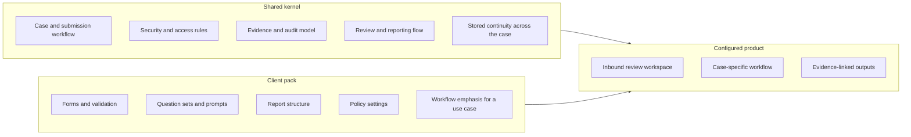

# Kernel and Client Pack

Shared kernel, client pack and configured product. Kernel rules are fixed; the pack adapts the product for a specific review use case.

## Diagram

The shared LumiSense core stays the same, while the client pack shapes the workflow for a specific use case.
