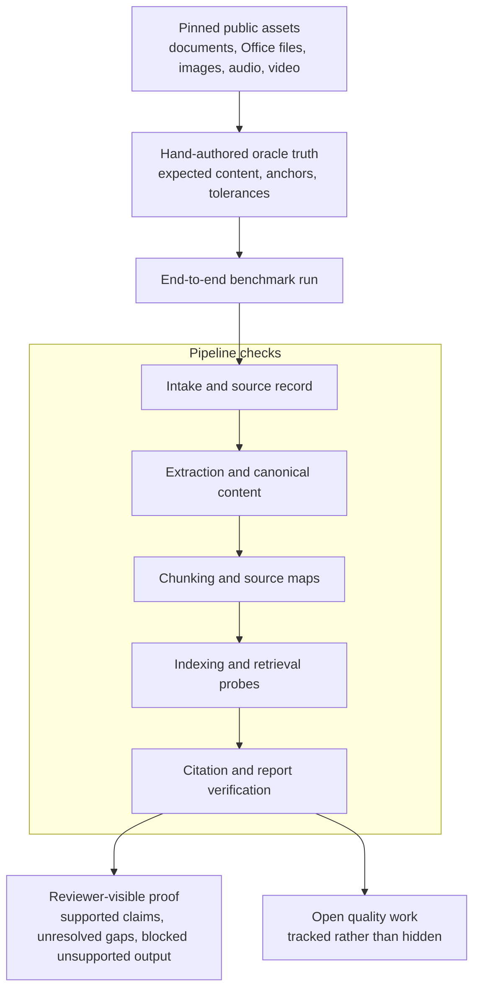

# Benchmark and Validation

Benchmark inputs are pinned, runtime changes are checked against stored expectations, and current results include open quality work. The goal is to prove the evidence workflow, not only to show a polished demo.

## Diagram

## What is checked

The validation lane checks whether material can move from raw input to reviewable evidence without losing provenance. For multimodal files, that includes source maps for documents and temporal anchors for audio or video.

The strongest checks are citation checks: the quoted span must exist, the anchor must resolve, and the evidence must belong to the current case. Unsupported claims should not enter a formal report.

LumiSense is developed with repeatable benchmark inputs and reviewable results, not only with demos.
