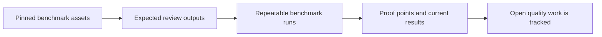

# Benchmark and Validation

Benchmark inputs are pinned, runtime changes are checked against stored expectations, and current results include open quality work.

## Diagram

LumiSense is developed with repeatable benchmark inputs and reviewable results, not only with demos.
