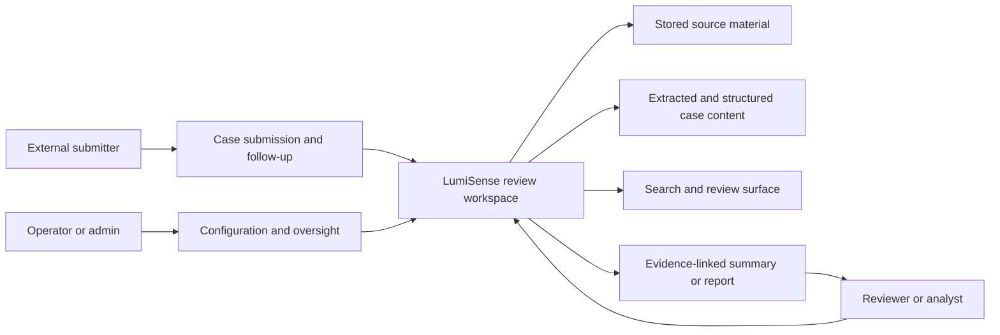

# System Context

High-level view: submitter, reviewer and operator around the review workspace.

## Diagram

LumiSense sits between incoming materials and reviewer decisions, keeping the workflow structured and the outputs tied to case evidence.
