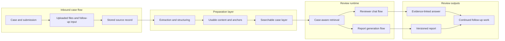

# Review Runtime

Runtime path from case input to evidence-linked answer or versioned report, with continuity across follow-up work.

## Diagram

LumiSense uses the same case state for retrieval, reviewer chat and report output, which keeps follow-up work consistent.
