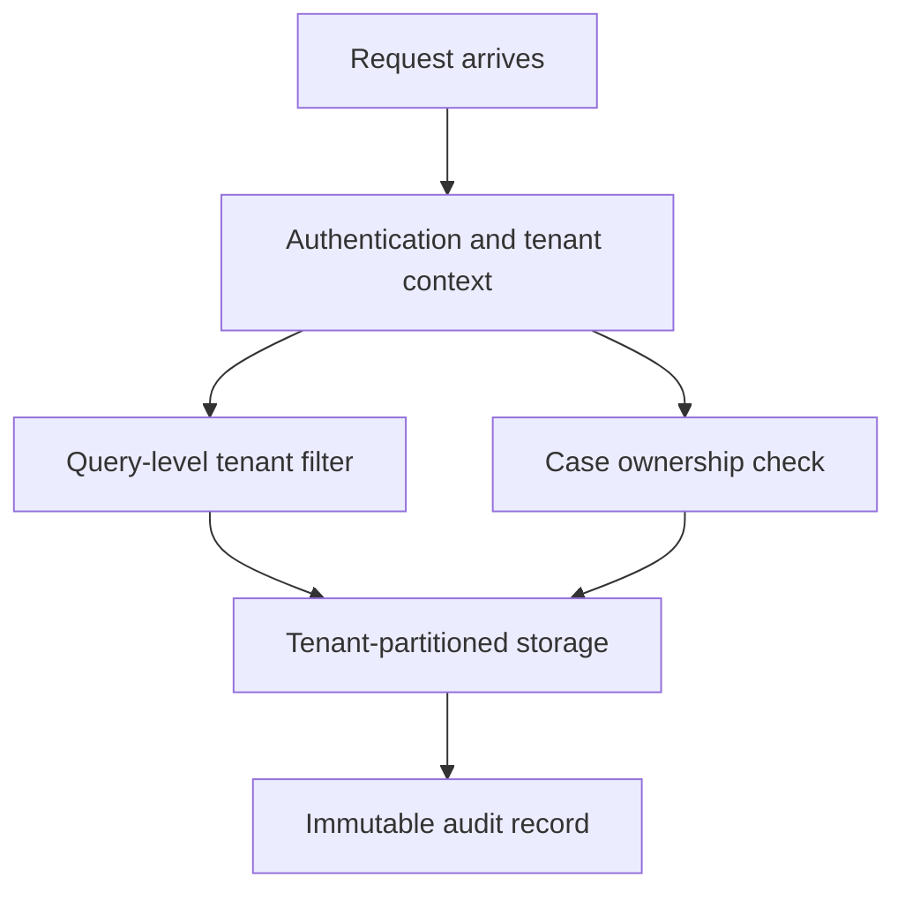

# Security Boundaries

Four layers of isolation between tenants and cases, applied on every request, with an immutable audit tying them together.

## Diagram

## Layers

1. Authentication and tenant context. Every request carries identity and tenant claims. Requests without a resolved tenant are rejected.
2. Query-level tenant filter. Data access is filtered by tenant at the ORM boundary. Application code that forgets a filter still cannot read across tenants.
3. Case ownership check. Beyond the tenant, each run verifies access to the specific case. Cross-case attempts are recorded in audit.
4. Tenant-partitioned storage. Raw material is stored per tenant with write-once semantics. Submissions are immutable after upload.

A run writes its inputs, outputs and configuration snapshot to an immutable record. A reviewer returning to a case later can reconstruct what happened.

LumiSense enforces tenant and case isolation at authentication, query, ownership and storage layers, with an immutable audit record connecting them.
