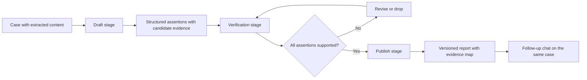

# Report Generation

A report is a three-stage workflow with evidence binding at each step.

## Diagram

## Stages

Draft. The system proposes the report as a set of structured assertions, each with a candidate source.

Verification. Each assertion is checked against retrieved evidence. Quotes must exist in the source. Anchors must resolve. Unsupported assertions are revised or dropped.

Publish. The report is written as a versioned output with an evidence map. The next version of the same report builds on this one rather than starting fresh.

Splitting draft, verification and publish into explicit steps makes unsupported claims visible rather than hiding them in fluent prose.
